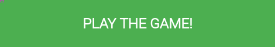

# Rectangles

A 2D Game created with [p5.js](https://p5js.org/).

# Rules of the game

1. Alright, listen up!

2. This is a game, and to play it, you just click on the play area to get a rectangle of random size. You place it in such a way that it doesn't cross another rectangle's length / width.

3. If the rectangle crosses another rectangle, Game Over!

4. You get a point for every rectangle you place.

# Todo

- No animations yet.

- Better looking scores and lives, maybe add images, or inside canvas. Add dark overlay for background whenever modal opens.

- Firebase to store scores and creating accounts for players

- Store the scores, and have a leaderboard

- Haven't checked all the edge cases yet, so god fucking damnit.

- Pointer events, need to figure out how the F do I get this to work on phone. Most difficult part, makes sense to run away from this as far as I can.
