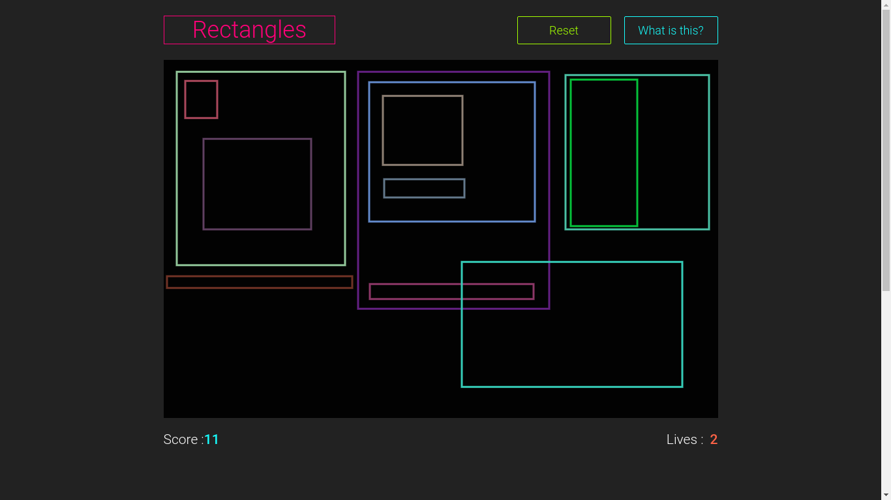

# Rectangles

A 2D Game created with [p5.js](https://p5js.org/).

# Rules of the game

1. This is a simple game, and to play it, you just click on the play area to get a rectangle of random size. You place it in such a way that it doesn't cross another rectangle's length / width.

2. You start with 3 lives. If the rectangle you're placing crosses any existing rectangle, you lose a life.

3. You get a point for every rectangle you place.

